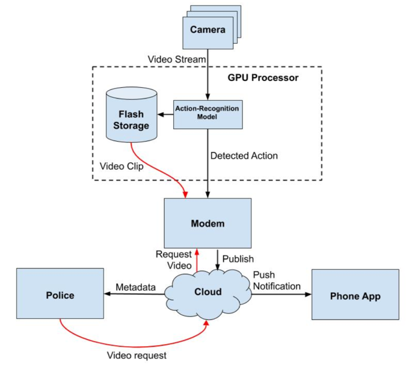
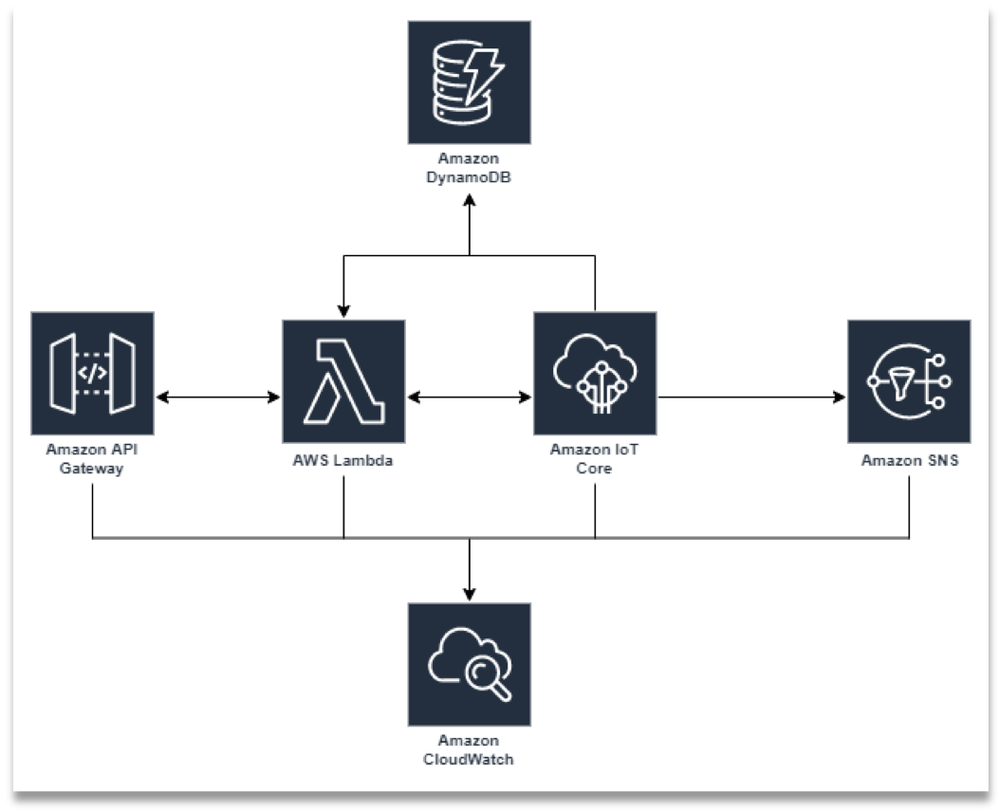
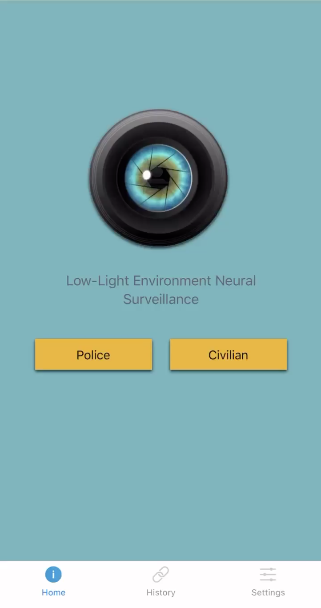
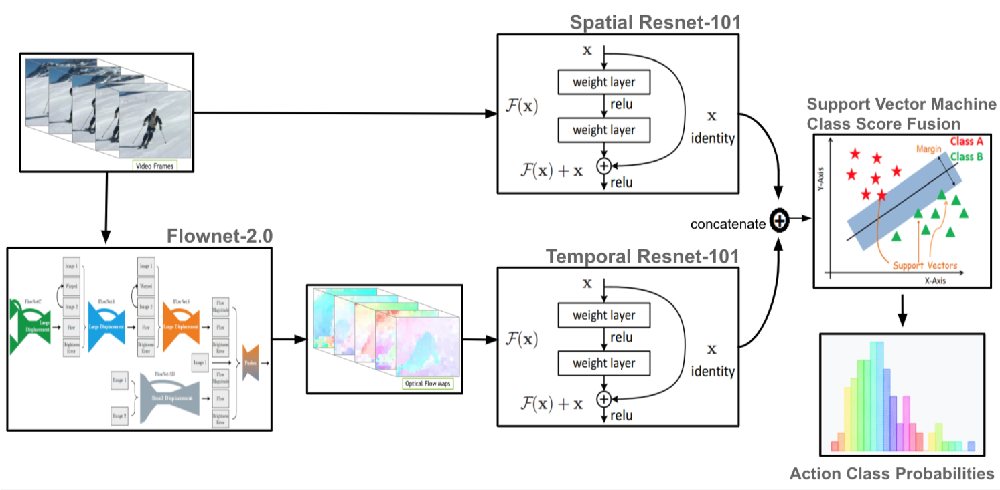

# Low-light Environment Neural Surveillance (LENS)


A crime detection system for low-light environments. 

2nd place winner in Northeastern University's ECE capstone design competition, Fall 2019.

## Overview


We have designed and implemented a system for criminal activity detection in low-light environments. Unlike CCTV, which is a reactive system, the LENS system can be used to get real time crime alerts. The system uses an ELP Sony IMX322 low-light camera and a NVIDIA Jetson TX2 embedded GPU running the [FlowNet2-CSS](https://arxiv.org/abs/1612.01925) optical flow network, [spatial and temporal](https://arxiv.org/abs/1406.2199) ResNet-101 action recognition networks, and a support vector machine (SVM) to identify shootings, assaults, and thefts as they occur. Users can then receive a notification alerting them of the crime and have the opportunity to view a video of the crime should they deem the notification credible.

The system uses modified versions of NVIDIA's (@NVIDIA) **FlowNet2** for calculating optical flow and Jeffrey Huang's (@jeffreyyihuang) **Two Stream Action Recognition** for performing the action recognition.

## Network


The three main network components in the system are the edge computers, cloud services, and the clients. The edge computers used Amazon FreeRTOS and AWS IoT Greengrass to process the images, perform inference using the computer vision models, and communicate with the cloud. The edge computers are WiFi enabled and communicate to a local router connected to local network of edge computers. On the edge machine, AWS IoT Greengrass and Amazon FreeRTOS acted as the local OS and send messages to the cloud. In the cloud, AWS IoT Core, S3, and Lambda functions process incoming messages and relay them to the client. The client is a mobile app that was be authenticated with the cloud to consume and send messages and requests. These messages were handled with REST API calls to populate the mobile app and notify users. 

## App


The user interface is a mobile app that allows users to monitor and control the system in real time. Notifications appear on the users phone that show what kind of crime is occurring and where the crime is taking place based off of when the cameras are located. A user monitoring the app can then notify others in the area where the crime is taking place through a mobile push and text notification. The app is written in React Native and node.js.
 
## Dataset
The system was trained and tested with the LENS dataset recorded and created by our team. The team acted out three types of crimes wearing various clothing to try and prevent overfitting. However, because the data was collected using only our team members and a few friends, we recognize that it is impossible to prevent. That being said, it is good enough to prove the concept and verify the pipeline.

If there is any interest in using the data, submit an issue and I will make it available to download.

## Models


The computer vision algorithm used consisted of two parts: dense optical flow calculation and action prediction. For the dense optical flow calculation we used FlowNet2.0, a fully convolutional approach developed at the University of Freiburg, and for the action recognition we used a two stream approach developed at the University of Oxford.

## Results


The F1 scores, which are the harmonic mean between precision and recall, were around 70-75%, which is similar to or a slight improvement upon the papers we based our research on. Using the Cloud GPU, the system achieved a runtime of 20 FPS for FlowNet2.0, 50 FPS for spatial ResNet, and 45 FPS for temporal ResNet. However, when transferred to the embedded GPU, performance degraded to 2 FPS, 10 FPS, and 10 FPS respectively due to the reduced processing power.

If there is any interest in using our trained models, please submit an issue and I will make them available to download.

## Further Reading
For more information, read our [final report](./docs/LENS_report.pdf) or check out or [presentation](./docs/LENS_presentation.pdf).

## Usage
### Installation
We recommend using Anaconda for managing the environment. This allows easy installation and keeps the environment separate from the rest of the system.

```bash
# Create conda environment and install dependencies
conda env create -f environemnt.yml
conda activate lens

# Install FlowNet2
cd flownet2-pytorch
bash install.sh
```

### Clip Generation
In order to train the network on your own data, you must first record and label videos according to the [UCF-101 dataset](https://arxiv.org/abs/1212.0402) guidelines. 

Once this is done, move all the videos into a single directory, which in this example is defined as `data/`.

Finally, run the following command:

```bash
python generate_clips.py --video /path/to/data/ \
						 --output /path/to/output/directory/ \
						 --skip 1 \
						 --duration 4 \
						 --model FlowNet2CSS \
						 --optical_weights /path/to/FlowNet2-CSS_weights.pth.tar
```

This will chunk each video into 4 second (`--duration 4`) clips, skipping every other (`--skip 1`) frame, and save the RGB and optical flow frames into `/path/to/output/directory/rgb/` and `/path/to/output/directory/flownet2/` directories respectively. The optical flow will be calculated using the FlowNet2-CSS model (`--model FlowNet2CSS`).

### Training
Model training is done within the individual model repos. For more information, check out the [two-stream action recognition](./two-stream-action-recognition/README.md) and [flownet2](./flownet2-pytorch/README.md) READMEs.

Both the spatial and temporal networks are pretrained on the UCF101 dataset before being fine-tuned on our dataset.

### Cloud Networking
In order to allow the inference pipeline to interface with the AWS cloud services, you first need to configure and download all required AWS certificates and secret keys, which are detailed in the [LENS_Network](./LENS_Network/README.md) repo.

Once that is done, run the following command in a separate terminal from the inference pipeline.

```bash
cd LENS_Network/
python -i MessageHandler.py
```

This will start up the message handler, connect to AWS, and listen for subscribers. Once it is up and running, the inference pipeline can be started.

### Inference
Inference can be performed on an individual video or a video stream using OpenCV. 

```bash
python pipeline.py --stream /path/to/video.mov \
                   --model FlowNet2CSS \
                   --svm /path/to/svm/model.pkl \
                   --nb_classes 4 \
                   --skip_frames 1 \
                   --save /path/to/directory/ \
                   --optical_weights /path/to/FlowNet2-CSS_weights.pth.tar \
                   --spatial_weights /path/to/spatial_weights.pth.tar \
                   --motion_weights /path/to/motion_weights.pth.tar
```

If running on a stream, the camera number or `.sdb` file path should be passed to the `--stream` flag instead of a path to a video. Also, make sure the optical flow model architecture matches between the `--model` and `--optical_weights` flags.
